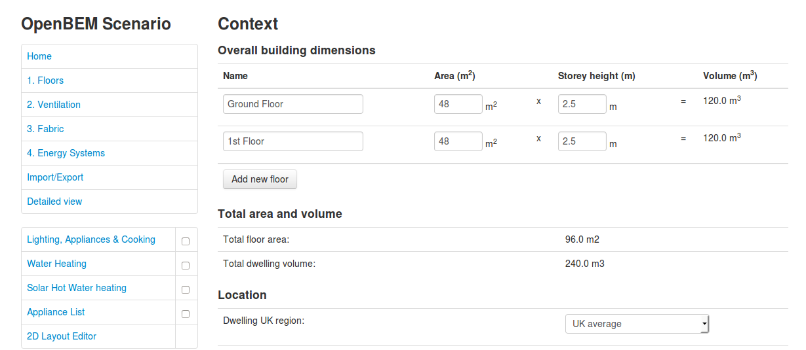
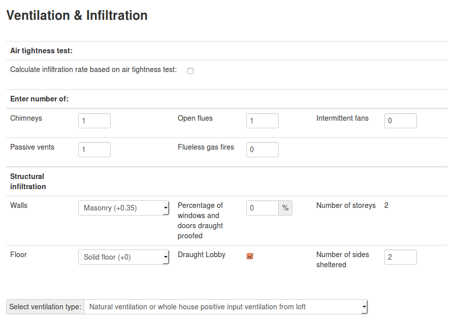
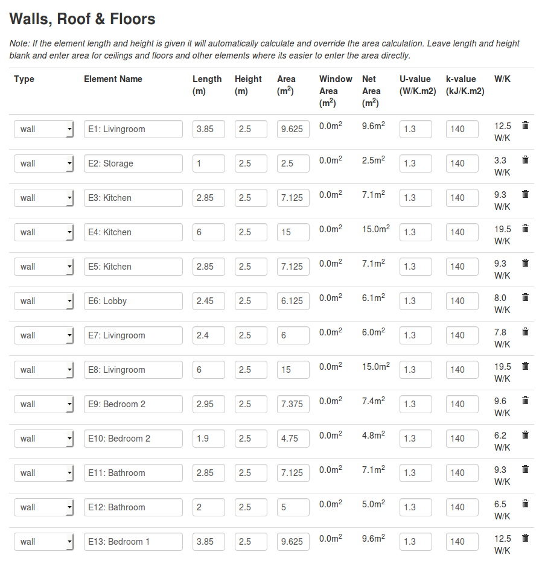
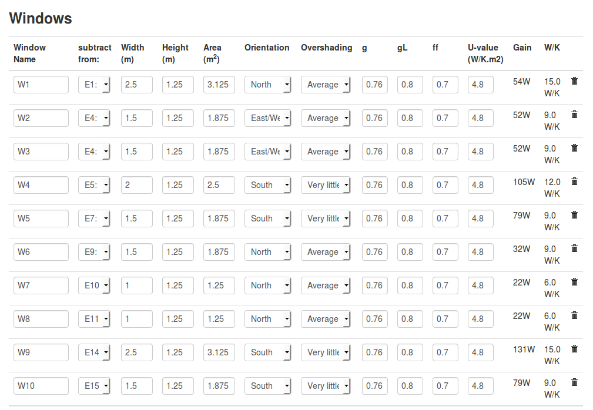
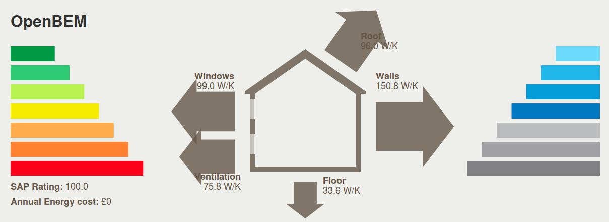
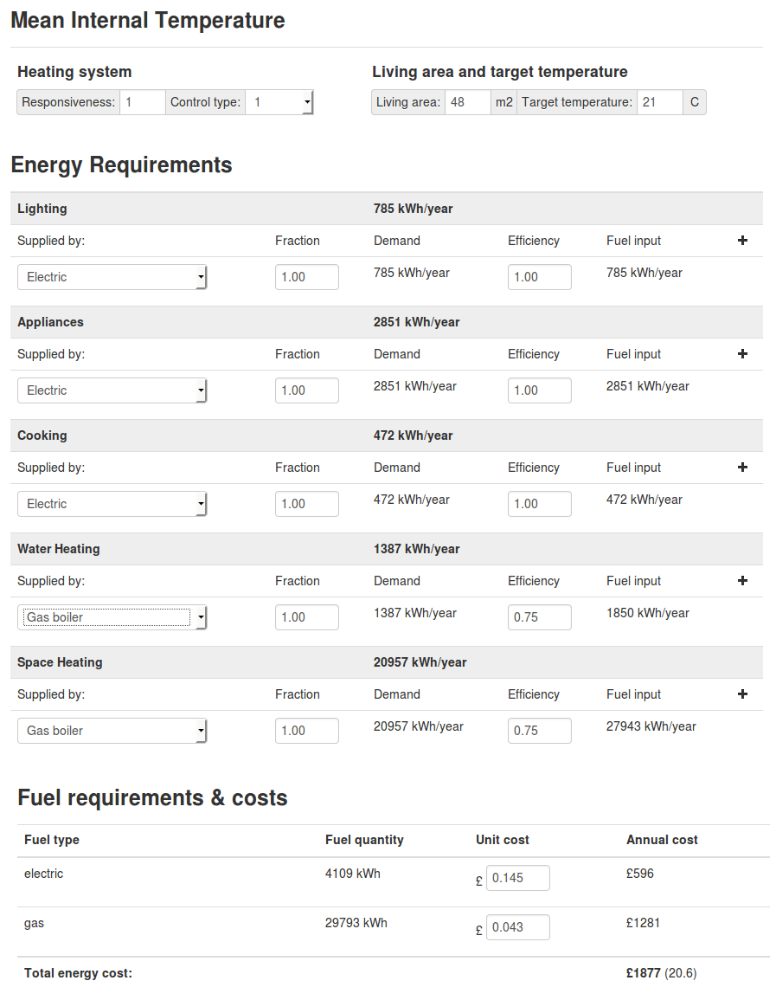
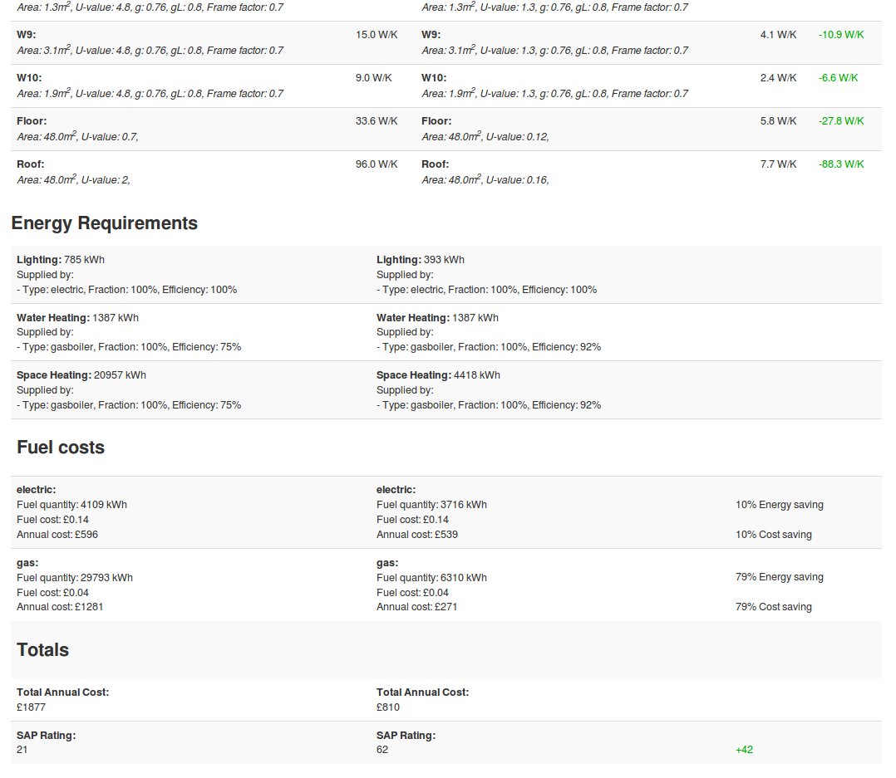

# How to do your own home energy assessment

This guide walk's through doing your own home energy assessment for working out to begin with where energy is lost in your home and then for working out the effect of carrying out home energy efficiency measures such as external wall insulation, installing higher performance windows or changing a heating system.

It makes use of the online free to use, open source energy assessment software we've been developing here as a collaboration between OpenEnergyMonitor and Carbon Coop.

**Try it out:** [http://emoncms.org/openbem/monthly](http://emoncms.org/openbem/monthly)

## Measuring up your home

Start by drawing a floor plan of your house, this could be on paper or using a program such as paint, open office draw or a CAD package. Draw an indication of wall widths and include internal walls.

Measure each wall dimension without initially taking into account the window's and doors, place the dimension on the floorplan. 

Draw the windows and doors on the floor plan and note each windows width and height.

Label each room and note the room height.

Here's an example floor plan, showing wall dimensions, windows and room heights. We will be using this example house throughout this guide.

The example will start with an uninsulated, draughty house with single glazed windows and then explore the energy savings possible through carrying out a retrofit.

Start in the top-left corner and work clockwise labelling each external wall with a unique name: E1, E2, E3 etc

Then do the same for the windows.

## Create an OpenBEM project

- Login or create an account in emoncms: [http://emoncms.org/user/login](http://emoncms.org/user/login)
- Navigate to *Extras* and then *OpenBEM v3*.
- Click on create new project, you can give the project a name and a description.
- Open the project
- Create a new scenario (this will be the base scenario)
- Open the scenario

The scenario will open on the Context page (1. Floors from the navigation on the left).

## 1. Floors: 

Calculate the area of each floor not including internal walls of each floor, enter each floor in the floor section of the calculator.

In our example here there are two floors each 6 meters by 8 meters and 2.5m high:

[http://emoncms.org/openbem/monthly#context](http://emoncms.org/openbem/monthly#context)

## 2. Ventilation

## 3. Fabric

The Fabric section is used to enter the dimensions, u-values and other thermal properties of all external and internal walls, floors, the roof and windows of your building. 

### Walls

Enter each wall in order following the floor plan labelling. In our example the first wall section E1 has a length of 3.85m, a height given by the room height of 2.5m and is an uninsulated cavity wall with a U-value of 1.3 W/K.m2 and K-value of 140 kJ/K.m2. E2 has a length of 1.0m, a height of 2.5m and is a continuation of the uninsulated cavity wall with a U-value of 1.3 W/K.m2 and K-value of 140 kJ/K.m2:

U-values and K-values for several types of common construction can be found in the [Element Library](ElementLibrary.md).

### Floor and Roof

In the example the ground floor area is 48m2 and is an uninsulated solid floor with a U-value of 0.7 W/K.m2 and a K-value of 75 kJ/K.m2 from the Element Library. 

The Roof is also 48m2 measured as the area of the loft, an uninsulated loft has a u-value of 2.0 W/K.m2 and a K-value likely to be around 18 kJ/K.m2 similar to a timber frame wall.

The area's can be used directly in the element list rather than entering a length and height, enter the floor and roof in the same element list as the walls.

### Windows

The window section requires additional inputs in order to calculate the contribution to heating from solar gains. Its also possible to subtract window area's from particular wall sections. This both simplifies the calculation procedure for wall areas and provides a convenient way of associating a window with a wall for reference.

Enter each window, its width, height, orientation, overshading level and U-value from the Element Library.

**Example:** Window 1 (W1) is 2.5m wide and 1.25m high, it is positioned in external wall E1. It faces North and is averagely shaded. The U-value for single glazing is 4.8 W/K.m2

Once a window has been entered and the wall that it is to be subtracted from is selected from the dropdown menu the wall list will update with the window area and show the resultant net wall area:

With the ventilation and fabric sections completed the house heat loss graphic should now show all the sources of heat loss and their relative magnitudes:

## 4. Energy Systems

The space heating requirements for our example uninsulated house under energy requirements should read 23084 kWh. Click on the plus button to add a heating system. Lets give our example home an old gas boiler with an efficiency of 75%. You will at this point get your first indication of energy cost and the SAP rating. The SAP rating is directly proportional to the annual cost of the energy supplied. 

The energy cost does not yet include the energy cost for lighting, appliances, cooking and water heating which will all contribute to heating the house and will reduce the space heating requirements. These sections can be added by completing the input sections for each of these energy requirements and then clicking the tick box to include them.

Our example house has 12 fixed lighting outlets all non-low-energy and uses instantaneous water heating. Electricity is used to supply energy for lighting, appliances, cooking. Water heating and space heating is provided by the gas boiler.

Screenshot of the resultant energy systems page:

## Create a retrofit scenario

This next section will explore creating a retrofit scenario, where we explore the effect of insulating walls, upgrading windows and changing heating systems.

- Navigate back to the scenario list for the project you created earlier.
- Click on *Clone*
- Open the Clone scenario.

### Reducing un-needed ventilation

Our example house had an open chimney that could be blocked with a chimney ballon. Set the number of chimney's to 0. We will also improve the draught proofing in our scenario when we change the windows so lets set that at 100% draught proofed. These changes did not appear to have a very large effect in the model, the energy cost only reduced from £1877 to £1814/year. Does the SAP model under-estimate the savings possible here?

### Insulating the cavity walls

Insulating cavity walls can drop the U-value from around 1.3 W/K.m2 to 0.3 W/K.m2. Where this option is available and is done with a full and consistent fill, it can be a very cost effective energy saving measure. After applying a U-value of 0.3 W/K.m2 to all the external walls in the model the annual energy cost drops from £1814/year to £1501/year.

### Insulating the loft

Insulating the loft with 250mm of insulation a U-value of 0.16 W/K.m2 drops the annual energy cost from £1501/year to £1242/year

### Insulating the floor

Insulating the floor with 100mm of insulation a U-value of 0.12 W/K.m2 drops the annual cost from £1242 to £1155/year.

### Upgrading the windows

If we then upgrade the windows from single glazed units to Triple-low-E Argon fill or double super low-E with a U-value of 1.3 W/K.m2 drops the energy cost from £1155/year to £920/year.

### Upgrading the lighting

Switching to 12 low energy lighting fittings £920 -> £872

### Upgrading the gas boiler or switching to a heatpump

Upgrading the gas boiler to a 92% efficient model would results in £872 -> £810. Had the boiler been switched first the saving would have appeared much larger. The small saving at this stage is largely because we have reduced the demand so much with the fabric improvement measures.

The energy cost of the electricity for lighting, appliances and cooking is now amost twice that of space heating.

### Compare scenarios

- Navigate back to the scenario list for the project you created earlier.
- Click on the Compare button on the Clone scenario.

A summary of all the measures applied is presented. We can see that our retrofit reduced the space heating energy requirement by 79% and the electricity demand by 10%. The SAP rating increased from 21 to 62 and the annual cost reduced from £1877 to £810

