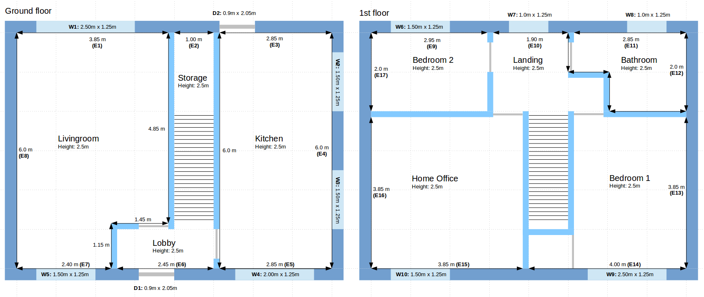

# How to do your own home energy assessment

This guide walk's through doing your own home energy assessment for working out to begin with where energy is lost in your home and then for working out the effect of carrying out home energy efficiency measures such as external wall insulation, installing higher performance windows or changing a heating system.

It makes use of the online free to use, open source energy assessment software weve been developing here as a collaboration between OpenEnergyMonitor and Carbon Coop.

**Try it out:** [http://emoncms.org/openbem/monthly](http://emoncms.org/openbem/monthly)

## Measuring up your home

Start by drawing a floor plan of your house, this could be on paper or using a program such as paint, open office draw or a CAD package. Draw an indication of wall widths and include internal walls.

Measure each wall dimension without initially taking into account the window's and doors, place the dimention on the floorplan. 

Draw the windows and doors on the floor plan and note each windows width and height.

Label each room and note the room height.

Here's an example floor plan, showing wall dimensions, windows and room heights. We will be using this example house throughout this guide.

The example will start with an uninsulated, draughty house with single glazed windows and then explore the energy savings possible through carrying out a retrofit.

Start in the top-left corner and work clockwise labelling each external wall with a unique name: E1, E2, E3 etc

Then do the same for the windows.

## 1. Floors: 

Calculate the area of each floor not inculding internal walls of each floor, enter each floor in the floor section of the calculator.

In our example here there are two floors each 6 meters by 8 meters and 2.5m high:

[http://emoncms.org/openbem/monthly#context](http://emoncms.org/openbem/monthly#context)

## 3. Fabric

The Fabric section is used to enter the dimensions, u-values and other thermal properties of all external and internal walls, floors, the roof and windows of your building. 

### Walls

Enter each wall in order following the floor plan labelling. In our example the first wall section E1 has a length of 3.85m, a height given by the room height of 2.5m and is an uninsulated cavity wall with a U-value of 1.3 W/K.m2 and K-value of 140 kJ/K.m2. E2 has a length of 1.0m, a height of 2.5m and is a continuation of the uninsulated cavity wall with a U-value of 1.3 W/K.m2 and K-value of 140 kJ/K.m2:

U-values and K-values for several types of common construction can be found in the [Element Library](ElementLibrary.md).

### Floor and Roof

In the example the ground floor area is 48m2 and is an uninsulated solid floor with a U-value of 0.7 W/K.m2 and a K-value of 75 kJ/K.m2 from the Element Library. 

The Roof is also 48m2 measured as the area of the loft, an uninsulated loft has a u-value of 2.0 W/K.m2 and a K-value likely to be around 18 kJ/K.m2 similar to a timber frame wall.

The area's can be used directly in the element list rather than entering a length and height, enter the floor and roof in the same element list as the walls.

### Windows

