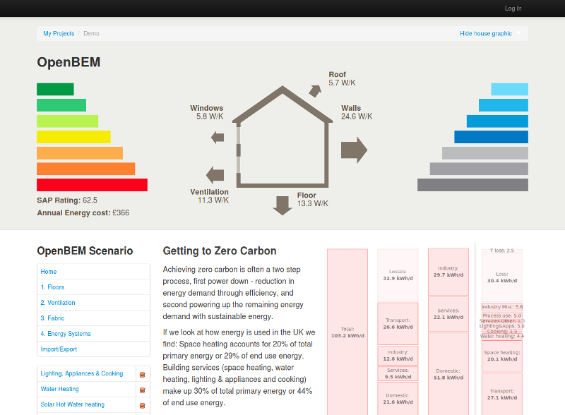
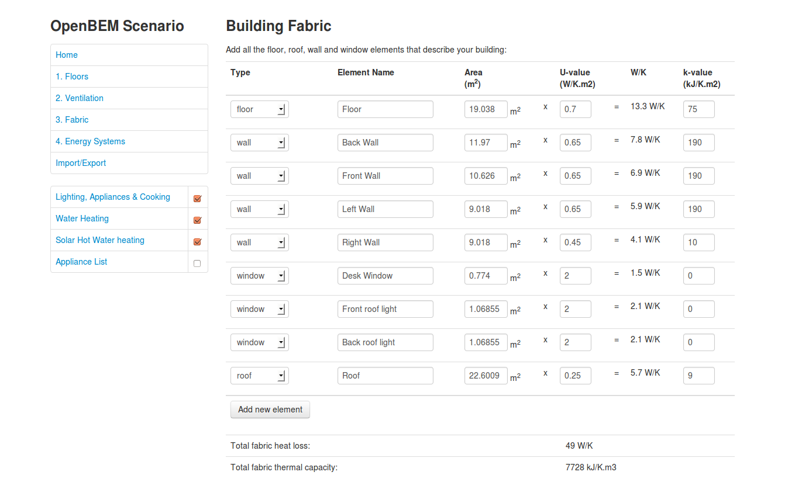

## OpenBEM - Open Source Building Energy Model

This work is all open source - under GPL.

### Getting to Zero Carbon
    
Achieving zero carbon is often a two step process, first power down - reduction in energy demand through efficiency, and second powering up the remaining energy demand with sustainable energy.
    
If we look at how energy is used in the UK we find: Space heating (in all buildings) accounts for 20% of total primary energy or 29% of end use energy. Building services (space heating, water heating, lighting & appliances and cooking) make up 30% of total primary energy or 44% of end use energy. (2012 data)

Low energy building technology: highly insulated, air-tight buildings can deliver space heating energy savings of up to 50-90% while simultaneously increasing our comfort.

[OpenEnergyMonitor: Sustainable Energy page](http://openenergymonitor.org/emon/sustainable-energy)

    
OpenBEM is an open source energy assessment tool to help you explore how you can achieve this level of performance improvement in your own home.
    
The model used is based on the 2012 version of SAP (Standard Assessment Procedure for UK EPC's (Energy Performance Certificate's)) developed by the Building Research Establishment for which the full specification can be downloaded from BRE here: [SAP-2012_9-92.pdf](http://www.bre.co.uk/filelibrary/SAP/2012/SAP-2012_9-92.pdf)
    
### Open Source
    
The source code for OpenBEM under GPL. You can download and install OpenBEM on your own server, you can look at and peer-review the model calculations, understand how it works, modify and improve it.

### Screenshots

**Front page**

**Element list**

### Older versions

[OpenBEM v2](https://github.com/emoncms/openbem/tree/master)

[SAP v1](https://github.com/emoncms/archive/tree/master/sap)

### Documentation

[OpenEnergyMonitor github: Building Energy Modelling](https://github.com/openenergymonitor/documentation/tree/master/BuildingBlocks/BuildingEnergyModelling)
